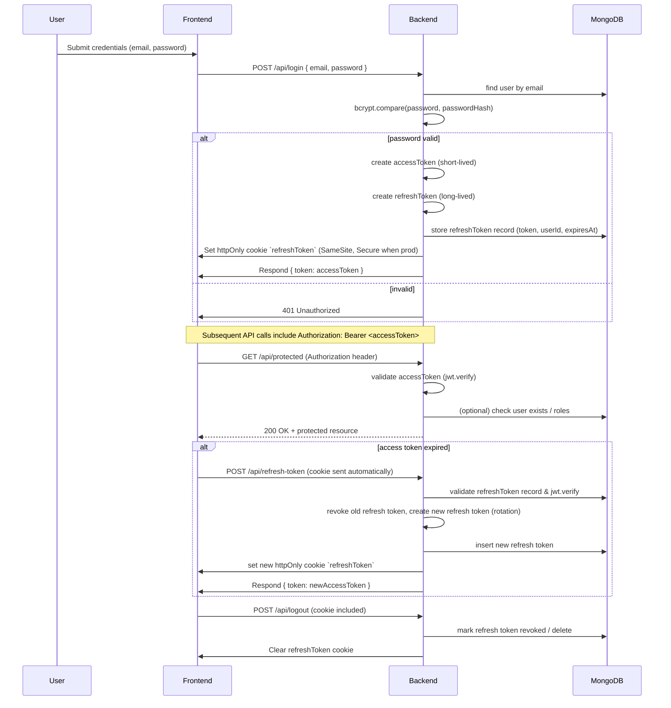

# Authentication Flow (JWT + Refresh Token)

This document describes the authentication flow used by the backend, including which endpoints are involved, where tokens are stored, token lifetimes, and security considerations. There's a compact Mermaid sequence diagram followed by implementation notes and examples.

---

## Quick sequence (Mermaid)



---

## Endpoints (implemented)

- POST /api/signup
  - Request: { email, password }
  - Action: hash password with bcrypt, insert user in `users` collection
  - Response: sets `refreshToken` cookie, returns access token JSON

- POST /api/login
  - Request: { email, password }
  - Action: verify password, issue access + refresh tokens, store refresh token in `refreshTokens` collection, set httpOnly cookie
  - Response: { token: <accessToken> }

- POST /api/refresh-token
  - Request: no body required; reads `refreshToken` from httpOnly cookie
  - Action: verify refresh JWT & DB record, rotate refresh token (revoke old, create new), set new cookie
  - Response: { token: <newAccessToken> }

- POST /api/logout
  - Request: cookie included
  - Action: revoke/delete refresh token record and clear cookie
  - Response: 200 OK

- GET /api/me (protected)
  - Requires valid access token via Authorization header (Bearer)
  - Middleware: `authenticateAccessToken` in `backend/middleware/auth.js`

---

## Token Properties and Lifetimes (recommended / current)

- Access token (JWT)
  - Purpose: short-lived bearer token for API authentication
  - Lifetime: short (recommended 15m). Current env: `JWT_EXPIRES_IN` (e.g. `24h` in dev). Consider 15m in production.
  - Content: { userId, iat, exp }
  - Sent by client: Authorization: Bearer <accessToken>

- Refresh token (JWT)
  - Purpose: long-lived token to obtain new access tokens without re-login
  - Lifetime: longer (recommended 7d or similar). Current env: `JWT_REFRESH_EXPIRES_IN` (e.g. `7d`).
  - Storage: httpOnly cookie named `refreshToken` and persisted server-side in `refreshTokens` collection for revocation and rotation.
  - Rotation: on each refresh, server revokes old token record and inserts a new one (prevents reuse after theft).

---

## Cookie settings (important)

- httpOnly: true (prevents JS access to cookie)
- secure: set to `true` in production (only sent over HTTPS)
- sameSite: `lax` or `strict` recommended to reduce CSRF risk; `lax` allows top-level navigation-based login flows.
- path: `/` (cookie sent to backend endpoints)

Example in code (backend):

```
res.cookie('refreshToken', refreshToken, {
  httpOnly: true,
  secure: process.env.NODE_ENV === 'production',
  sameSite: 'lax',
  maxAge: /* milliseconds for refresh token ttl */
});
```

## Security considerations & hardening

- Keep `JWT_SECRET` and `JWT_REFRESH_SECRET` in environment variables and rotate them via key-rotation strategy if needed.
- Use short `accessToken` lifetimes (e.g. 15 minutes) and reasonably short refresh lifetimes. Monitor refresh usage patterns.
- Always set `secure: true` in production so cookies are only sent over HTTPS.
- Consider HTTP-only cookie + CSRF protection: since refresh token is a cookie, either use SameSite=Strict/Lax or implement double-submit CSRF tokens for the refresh endpoint.
- Rate-limit login and refresh endpoints to limit brute-force and abuse.
- Persist refresh tokens server-side with a `revoked` flag and an `expiresAt` timestamp so you can invalidate tokens early and perform cleanup.
- Log suspicious refresh attempts (e.g., reuse of rotated token) and trigger account alerts.

## Failure modes & edge cases

- Refresh token missing or expired: reply 401 and require user to re-login.
- Refresh token JWT valid but not found in DB (replay or revoked): treat as token theft, revoke all tokens for user and require re-login.
- Access token expired but refresh token valid: issue new access token and rotate refresh token.

## Where in the codebase

- Route handlers: `backend/routes/auth.js`
- JWT verification middleware: `backend/middleware/auth.js`
- Mongo helper and collections: `backend/utils/mongo.js` (collections: `users`, `refreshTokens`)

## Example requests

- Login (returns access token; refresh cookie set):

```
POST /api/login
Content-Type: application/json

{ "email": "me@example.com", "password": "hunter2" }

Response: 200
{ "token": "<access-token-here>" }
Set-Cookie: refreshToken=<refresh-token>; HttpOnly; SameSite=Lax
```

- Refresh access token (cookie sent automatically):

```
POST /api/refresh-token
Response: 200
{ "token": "<new-access-token>" }
Set-Cookie: refreshToken=<new-refresh-token>; HttpOnly; SameSite=Lax
```

---

If you'd like, I can also:

- Embed this into `backend/README.md` instead of a separate file.
- Produce a PNG/SVG diagram exported from the Mermaid block and add it to the repo for README rendering on GitHub (Mermaid isn't rendered by default on GitHub README without enabled support).

If you'd like the doc moved into another location or adjusted for production token lifetimes, say which lifetimes and I'll update the doc and code comments accordingly.
