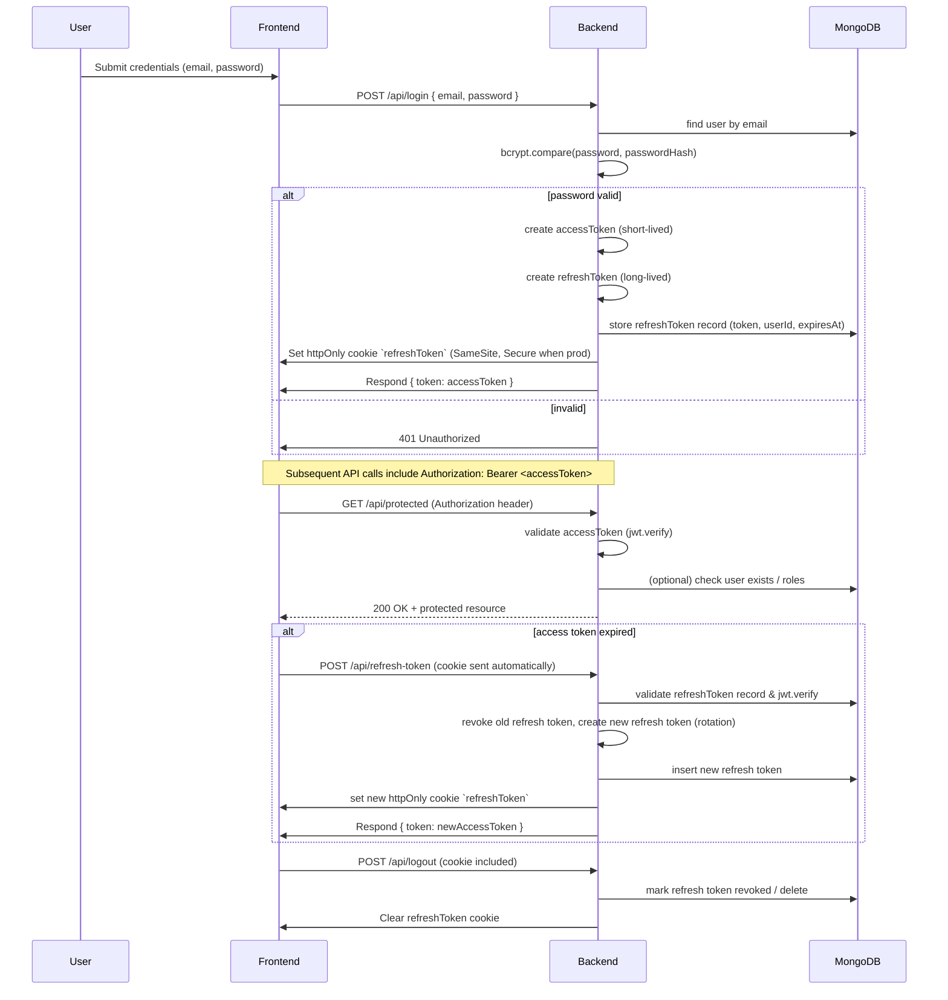

# Backend

This directory contains the backend application for ShadowMe.

## Getting Started

### With Docker
```bash
docker-compose up backend
```

### Local Development
```bash
npm install
npm start
```

## Structure

The backend application will be built here using Node.js.

## MongoDB / Atlas setup

This backend uses MongoDB for user storage. For production use, we recommend using a managed MongoDB service such as MongoDB Atlas.

1. Copy `.env.example` to `.env` and fill in your secrets. Do NOT commit `.env`.

2. Use a secure Atlas connection string for `MONGODB_URI`, e.g.:

	MONGODB_URI="mongodb+srv://<user>:<password>@cluster0.abcd.mongodb.net/?retryWrites=true&w=majority"

	If you use Atlas, set `MONGODB_TLS=true` or the helper will detect `mongodb+srv` and enable TLS automatically.

3. Start the server:

```powershell
cd backend
node index.js
```

Verification

- Sign up a user via `POST /api/signup` — it should return `{ token: "<jwt>" }` and the user will be persisted in your MongoDB database with `passwordHash` field.

Security notes

- Keep `JWT_SECRET` and `JWT_REFRESH_SECRET` secure and long.
- Ensure `NODE_ENV=production` when deploying so cookies are set with `secure: true`.
- Rotate refresh tokens on use and monitor for suspicious activity.

## Authentication Flow (JWT + Refresh Token)

This backend implements a JWT-based authentication flow with rotating refresh tokens. The flow is documented below with a Mermaid sequence diagram, endpoint references, cookie rules, and security notes.



### Endpoints

- POST `/api/signup` — hash password, insert user, set refresh cookie and return access token.
- POST `/api/login` — validate credentials, issue access & refresh tokens, persist refresh token, set cookie, return access token.
- POST `/api/refresh-token` — read refresh cookie, validate against DB, rotate token, set new cookie, return new access token.
- POST `/api/logout` — revoke/delete refresh token and clear cookie.
- GET `/api/me` — protected: requires Authorization: Bearer <accessToken> (see `backend/middleware/auth.js`).

### Tokens and cookies

- Access token: short-lived JWT used in Authorization header. Use a short TTL (e.g., 15m in production).
- Refresh token: long-lived JWT stored in an httpOnly cookie named `refreshToken` and persisted server-side for revocation/rotation. Recommended TTL: 7d.

Cookie example (server):

```js
res.cookie('refreshToken', refreshToken, {
	httpOnly: true,
	secure: process.env.NODE_ENV === 'production',
	sameSite: 'lax',
	maxAge: /* milliseconds */
});
```

### Security notes

- Keep secrets in `.env` and never commit them.
- Enforce `secure: true` for cookies in production and serve over HTTPS.
- Rate-limit authentication endpoints and monitor for token reuse patterns.

Implementations:

- Routes: `backend/routes/auth.js`
- Middleware: `backend/middleware/auth.js`
- Mongo helper: `backend/utils/mongo.js`
